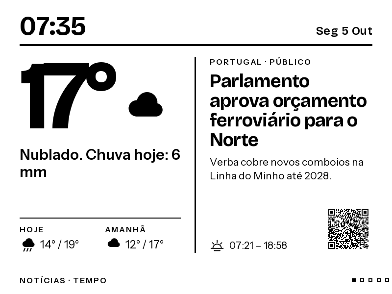
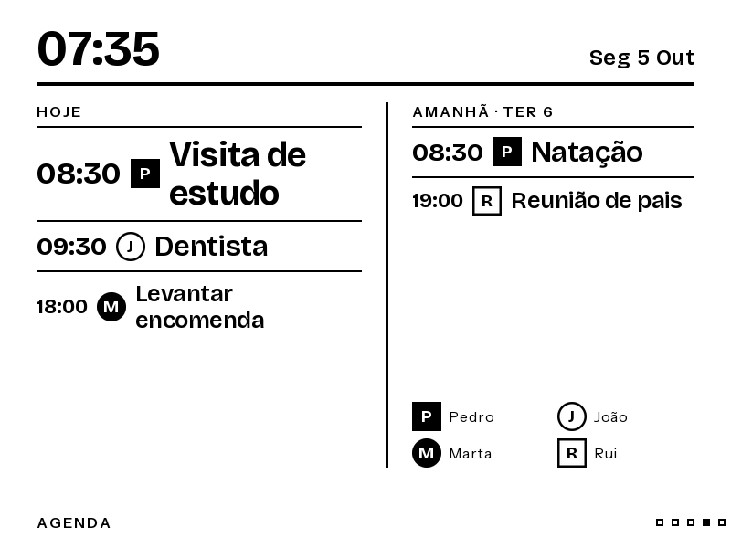
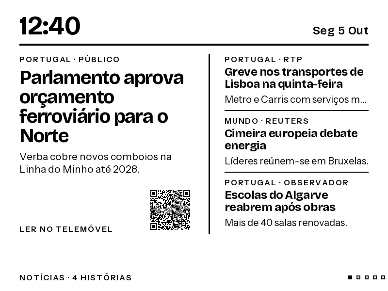
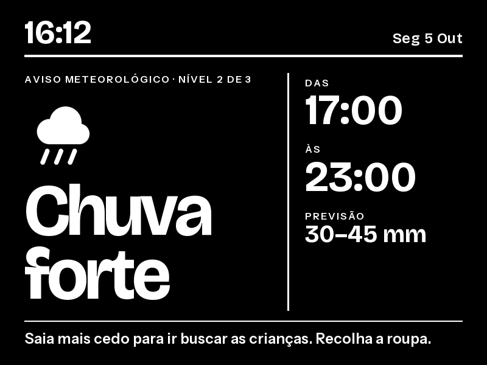
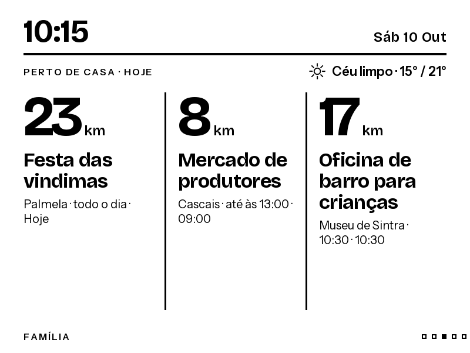

# Kindle Family Display

Turn an old Kindle into a calm, always-on family information screen.

A small Python service runs on a home server, gathers the things a family actually wants at a glance (weather, the day's commitments, the news that matters, what's on nearby), draws them as crisp black-and-white pages, and the Kindle simply shows the latest picture. No app on the Kindle, no cloud account, no scrolling ticker.

| | |
|---|---|
|  |  |
|  |  |
|  |  |

All screenshots use made-up example content.

## What it shows

Six pages, cycled automatically. Pages with nothing to say are skipped.

| Page | What's on it |
|---|---|
| **Notícias · Tempo** | Current temperature, today and tomorrow, sunrise and sunset, and the top news story with a QR code to read it on a phone. |
| **Notícias** | One lead story and up to three briefs. |
| **Família** | The next family commitment in large type, with up to two more beside it and a weather line. When nothing is due: the weather next to a daily curiosity, or a family photo. |
| **Agenda** | Today and tomorrow side by side, with a badge per person. A free tomorrow shows what comes next. |
| **Perto de casa** | Up to three upcoming public events nearby, with distance. |
| **Foto do dia** | A photo from a folder, full screen, dithered for e-ink. |

Some behaviour changes with the time of day:

- **Weather alerts** take over the first page as an inverted (white on black) screen with the start time, end time and amount, and a banner appears on the other pages.
- **At night** the family page shows only the first commitment of the next morning and tomorrow's forecast.
- **News windows**: in periods you choose, the news page steps through the most important stories instead of staying on one.

More examples: [quote page](docs/images/quote.png), [weather with curiosity](docs/images/weather-fact.png), [photo page](docs/images/photo.png).

## How it works

```text
calendars (ICS) · weather (Open-Meteo) · news (RSS) · event listings · photo folder
                               │  fetched on a schedule
                               ▼
                 normalised facts in a small SQLite cache
                               │  rules pick 1–3 items per page
                               │  (optional AI scores news importance)
                               ▼
              pages drawn with Pillow as greyscale PNG files
                               │
                               ▼
                 Kindle fetches the next picture over Wi-Fi
```

- **The Kindle is only a viewer.** It asks the server for an image every few minutes. All fetching, deciding and drawing happens on the server ahead of time, so the Kindle never waits on a slow source.
- **Rules first, AI optional.** Alerts and family commitments are chosen by plain rules. If you add an OpenAI key, a model scores each new headline for importance and groups stories about the same event, so the screen leads with what matters. Without a key, or if the provider fails, the newest stories are used.
- **Small footprint.** One container, no browser engine, about 50–90 MB of memory, capped at 190 MB.
- **Fails quietly.** If a source is down, the last good data stays on screen with a "stale" note.

The visual design (layouts, type, icons) was made as an HTML prototype and then rebuilt in Pillow; the written spec is in [docs/design-handoff.md](docs/design-handoff.md) (Portuguese). The interface text is in Portuguese; it lives in `app/rendering/renderer.py` if you want another language.

## What you need

- A Kindle with [KOReader](https://koreader.rocks/) installed (which requires a jailbroken Kindle) and the [TRMNL KOReader plugin](https://github.com/usetrmnl/trmnl-koreader). Built and tested for a Paperwhite 11th generation; other sizes are a configuration change.
- An always-on machine on the same network with Docker and Docker Compose (a mini PC, NAS or Raspberry Pi class device).
- Optional: shared calendar links (ICS), an OpenAI API key for news scoring, a folder of photos.

## Quick start

Demo mode needs no accounts or keys and shows example content.

```sh
git clone <this repository>
cd <repository folder>
cp config.example.toml config.toml
mkdir -p photos secrets
docker compose up --build -d
```

Then open `http://127.0.0.1:8000/kindle/news-weather.png` in a browser. The other pages are `news`, `family`, `calendar`, `nearby` and `photo` at the same address pattern. `http://127.0.0.1:8000/api/status` reports what was fetched and when.

## Configuration

Everything is in `config.toml` (kept out of version control). `config.example.toml` documents each setting. The main ones:

| Setting | What it does |
|---|---|
| `demo_mode` | `true` shows example content; `false` uses your sources. |
| `screen_width`, `screen_height`, `screen_rotation` | Output size. For a Paperwhite 11 held sideways: `1648`, `1236`, `90` (or `270`). |
| `[[calendar_feeds]]` | Shared calendar links (ICS), each optionally tied to a person. |
| `weather_latitude`, `weather_longitude`, `weather_location` | Turns on the Open-Meteo forecast. No key needed. |
| `weather_rain_disruption_mm`, `weather_wind_disruption_kph` | Forecasts above these trigger the alert page. |
| `[[rss_feeds]]` | News feeds. |
| `[[event_feeds]]` | Event listing pages that embed schema.org event data, with a rough distance from home. |
| `news_rotation_windows`, `news_digest_windows` | Periods such as `"07:30-08:30"` when the news steps through stories or shows the multi-story layout. |
| `night_window` | When the family page switches to "tomorrow morning". |
| `facts_enabled` | The daily curiosity. |
| `ai_enabled`, `ai_model`, `ai_news_min_score` | News importance scoring. Put the key in `secrets/ai_key`. |

Photos go in `photos/` (jpg or png). A descriptive file name becomes the caption.

Restart the container after editing: `docker compose up -d --force-recreate`.

### Making it reachable from the Kindle

By default the service only listens on the server itself. Create a `.env` file next to `compose.yaml` with the server's address on your home network:

```sh
BIND_ADDRESS=192.168.1.50
APP_PORT=8000
```

There is no login. Keep it on your home network and never expose it to the internet: the pages show your family calendar.

## Kindle setup

1. Copy the `trmnl.koplugin` folder into `koreader/plugins/` on the Kindle and restart KOReader.
2. Put any non-empty text in the plugin's `apikey.txt`. The plugin insists on a key; this server ignores it.
3. In the plugin settings, set the base URL to `http://<server address>:8000` (no path) and enable "use server refresh rate".
4. Start the TRMNL display.

Every fetch returns the next page, so the plugin's timer cycles the pages by itself (every 5 minutes), and anything that makes the plugin fetch again, such as a tap bound to refresh, acts as "next page".

## Updating a remote server

`scripts/deploy.sh user@host [remote-dir]` copies the project to another machine over SSH and rebuilds the container there. It leaves that machine's `.env` alone, copies `photos/` without deleting anything, and copies a local `openapi_key` file to `secrets/ai_key` if one exists.

## About the AI scoring

When enabled, the server sends only public headlines and short summaries from your news feeds to OpenAI, about once an hour and only for stories it hasn't scored before. Nothing from your calendar, location or photos is sent. Scores are cached on disk. The instructions given to the model are in `app/decision/ai.py`.

## Development

Python 3.12 or newer.

```sh
python3 -m venv .venv
. .venv/bin/activate
pip install -r requirements.lock
pip install -e '.[dev]'
cp config.example.toml config.toml
uvicorn app.main:app --host 127.0.0.1 --port 8000
```

```sh
python -m pytest
ruff check .
ruff format --check .
mypy app
```

Where things are:

| Path | Contents |
|---|---|
| `app/collectors/` | Calendar, weather, news and event fetching, and the pipeline that combines them. |
| `app/decision/` | Selection rules, news rotation, AI scoring, curiosities. |
| `app/rendering/` | Drawing primitives (`canvas.py`) and page layouts (`renderer.py`). |
| `app/main.py` | Web routes and the scheduled refresh. |
| `contracts/` | JSON schemas and the API description. |
| `docs/`, `ADRS/`, `ARCHITECTURE.md` | Design notes and decisions. |

## Limits and known gaps

- Text runs slightly wider than in a browser because the drawing library doesn't apply font kerning.
- The TRMNL plugin has no "previous page"; navigation is forward only.
- Distances for nearby events are one number per listing page, not per venue.
- There is no Bible verse source, reminders, travel mode or traffic alerts yet, although the layouts allow for them.

## Credits

- Fonts: [Bricolage Grotesque](https://fonts.google.com/specimen/Bricolage+Grotesque) and [Instrument Sans](https://fonts.google.com/specimen/Instrument+Sans), bundled under the SIL Open Font License (see `app/rendering/fonts/`).
- Weather data: [Open-Meteo](https://open-meteo.com/).
- Kindle client: [KOReader](https://koreader.rocks/) and the [TRMNL KOReader plugin](https://github.com/usetrmnl/trmnl-koreader).
- Much of the code was written with AI coding assistants, working from a separately made visual design.
